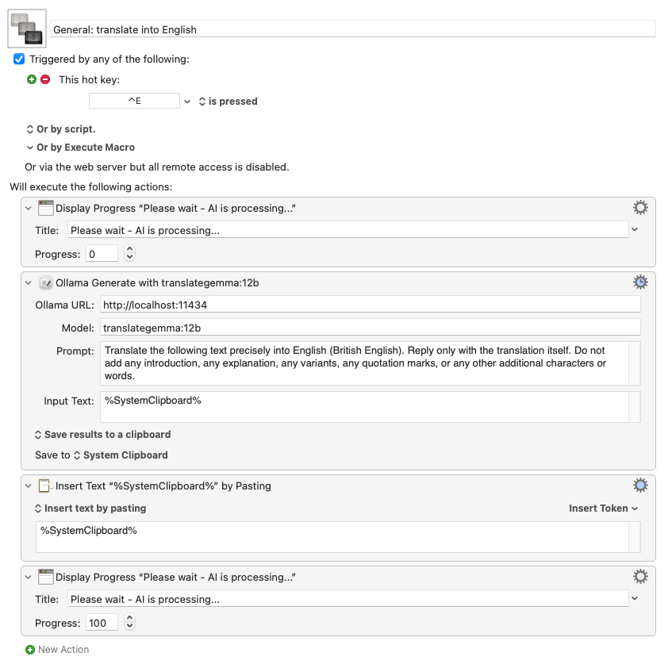

# Keyboard Maestro to Ollama Plugin

A [Keyboard Maestro](https://www.keyboardmaestro.com/) Plugin to send text and a prompt to a local [Ollama](https://ollama.com/) instance and use the response in your macros.

> **Note:** To use this plugin, you must have Ollama installed and running on your device. [Download Ollama for Mac here](https://ollama.com/download/mac).

## OpenAI-compatible endpoints and oMLX

This plugin is intentionally for Ollama's native `/api/generate` API. For OpenAI-compatible endpoints such as [oMLX](https://omlx.ai/), LM Studio, llama.cpp server, vLLM, and hosted OpenAI-compatible services, use the sister project [keyboardmaestro_to_openai](https://github.com/Itignos/keyboardmaestro_to_openai). That repository also includes the separate `keyboardmaestro_to_omlx_translategemma` action for oMLX-hosted TranslateGemma models.

## Installation

**Option 1: Quick Install**
Download the [latest `keyboardmaestro_to_ollama.zip`](https://github.com/Itignos/keyboardmaestro_to_ollama/releases/latest/download/keyboardmaestro_to_ollama.zip) from the repository and drag it onto the Keyboard Maestro Dock icon.

**Option 2: Build from Source**
1. Create the plugin archive by running `./build.sh`
2. Drag `keyboardmaestro_to_ollama.zip` onto the Keyboard Maestro Dock icon.

## Usage

In Keyboard Maestro, look for the action `keyboardmaestro_to_ollama` under "Third Party Plugins" or by searching.

### Parameters
- **Ollama URL**: The base URL of your Ollama instance (e.g. `http://localhost:11434`).
- **Model**: The model to use (e.g. `llama3`). Ensure you have pulled it via `ollama run llama3` first.
- **Prompt**: The system prompt or instructions (e.g. `Summarize the following:`).
- **Input Text**: The text to process. You can use standard Keyboard Maestro tokens here, such as `%SystemClipboard%` or `%Variable%MyText%`.

The result of the generation is returned natively to Keyboard Maestro, allowing you to "Save to Variable", "Display in Window", or "Save to Clipboard".

If Ollama rejects a request, returns invalid data, or cannot be reached, the plugin displays a native macOS error dialog with the underlying error message. This prevents Keyboard Maestro from silently hiding the script error.

## Example: Translation Macro

Here is an example of how to use the plugin with a local [TranslateGemma](https://ollama.com/library/translategemma) model on Ollama. The goal is to translate text on your device into English using a single keystroke (`⌃E` / `Ctrl-E`).

**Prerequisite**:
To make this example run, please be sure to download the model first. For example, you can pull the 4B parameter model by running in your terminal:
```bash
ollama run translategemma:4b
```
*(If you do not know which quantization to download: think how much memory you can allocate to this task. The "4b" version works quite well already. Higher parameter/quantization versions use more memory but are more precise.)*

**Macro Setup: "General: translate into English"**
- **Trigger**: Hot Key Trigger `⌃E` (Ctrl-E)

**Actions**:
1. **Display Progress**: 
   - Title: `Please wait - AI is processing...`
   - Progress: `0`
2. **Third Party Plugin Action**: `keyboardmaestro_to_ollama`
   - Ollama URL: `http://localhost:11434`
   - Model: `translategemma:4b`
   - Prompt: `Translate the following text precisely into English (British English). Reply only with the translation itself. Do not add any introduction, any explanation, any variants, any quotation marks, or any other additional characters or words.`
   - Input Text: `%SystemClipboard%`
   - Save results to a clipboard: `System Clipboard`
3. **Insert Text by Pasting**:
   - Text: `%SystemClipboard%`
4. **Display Progress**: 
   - Title: `Please wait - AI is processing...`
   - Progress: `100`




